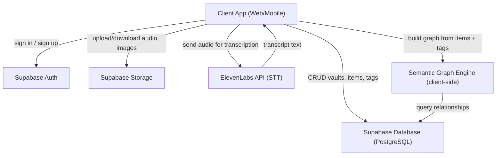
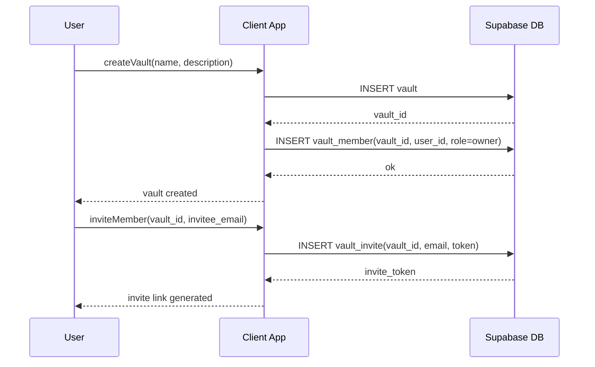
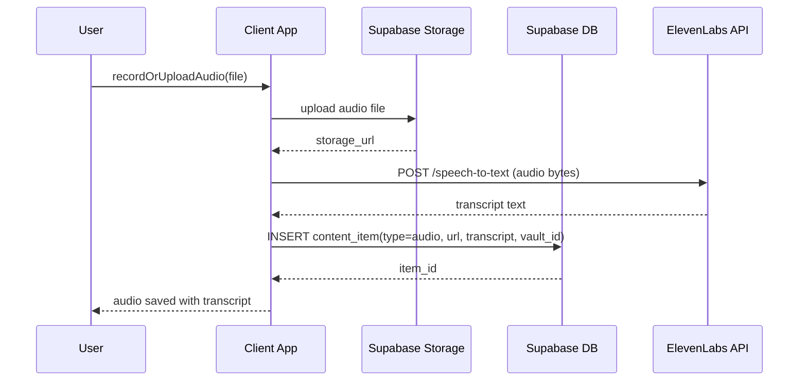
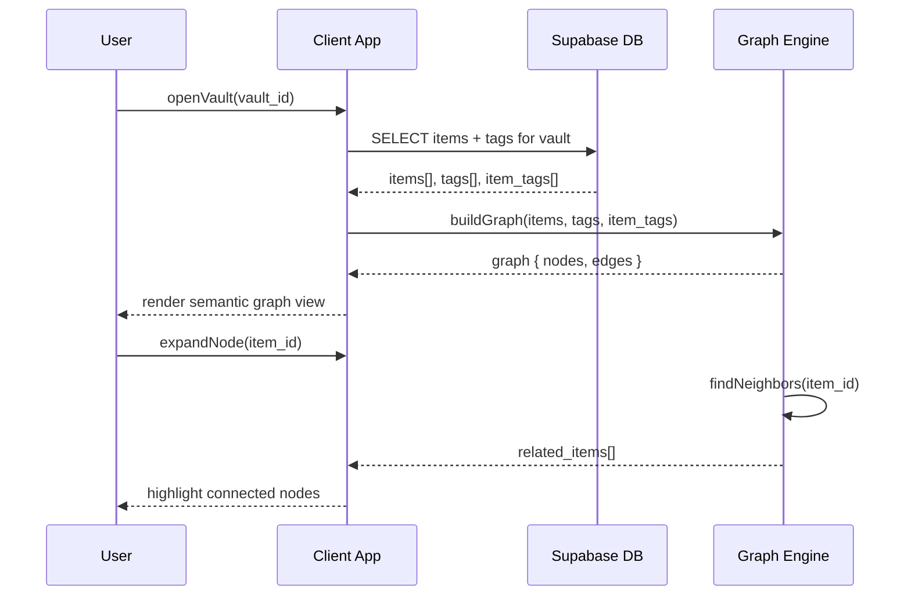

# Design Document: Cofre Vault Platform

## Overview

Cofre is a shared digital vault platform that replaces informal group chats (like WhatsApp groups) as a place to collaboratively store and discover information. A "Cofre" (vault) is a shared space where two or more users can upload, tag, and explore content — images, audios, and links — organized not as folders but as a **semantic graph**, where nodes are content items and edges are relationships formed by shared special tags.

The MVP focuses on three pillars: vault creation and membership, user authentication via Supabase, and rich audio features including in-app recording, upload, tagging, and automatic transcription via the ElevenLabs API.

The semantic graph model is the core differentiator: rather than browsing a hierarchy, users navigate a web of meaning. Special tags carry more semantic weight than regular tags and act as graph expansion points — connecting content across the vault in ways that surface relationships organically.

---

## Architecture



---

## Sequence Diagrams

### Vault Creation & Member Invitation



### Audio Upload & Transcription



### Semantic Graph Traversal



---

## Components and Interfaces

### Component 1: AuthService

**Purpose**: Handles user registration, login, session management via Supabase Auth.

**Interface**:
```pascal
INTERFACE AuthService
  PROCEDURE signUp(email: String, password: String): AuthResult
  PROCEDURE signIn(email: String, password: String): AuthResult
  PROCEDURE signOut(): Void
  PROCEDURE getCurrentUser(): User | Null
  PROCEDURE onAuthStateChange(callback: Function): Unsubscribe
END INTERFACE
```

**Responsibilities**:
- Delegate all auth operations to Supabase Auth client
- Expose reactive session state to the rest of the app
- Handle auth errors and surface them to the UI

---

### Component 2: VaultService

**Purpose**: Manages vault lifecycle — creation, membership, and access control.

**Interface**:
```pascal
INTERFACE VaultService
  PROCEDURE createVault(name: String, description: String): Vault
  PROCEDURE getVaultsForUser(user_id: UUID): Vault[]
  PROCEDURE getVaultById(vault_id: UUID): Vault
  PROCEDURE inviteMember(vault_id: UUID, email: String): InviteToken
  PROCEDURE acceptInvite(token: String): Vault
  PROCEDURE getMembers(vault_id: UUID): VaultMember[]
END INTERFACE
```

**Responsibilities**:
- Enforce that only vault members can read/write content
- Manage invite token generation and validation
- Track member roles (owner, member)

---

### Component 3: ContentService

**Purpose**: Manages content items (audios, images, links) within a vault.

**Interface**:
```pascal
INTERFACE ContentService
  PROCEDURE addItem(vault_id: UUID, item: ContentItemInput): ContentItem
  PROCEDURE getItems(vault_id: UUID): ContentItem[]
  PROCEDURE deleteItem(item_id: UUID): Void
  PROCEDURE attachTags(item_id: UUID, tag_ids: UUID[]): Void
  PROCEDURE getItemsByTag(vault_id: UUID, tag_id: UUID): ContentItem[]
END INTERFACE
```

**Responsibilities**:
- Upload binary files (audio, images) to Supabase Storage
- Store metadata and storage URLs in the database
- Link items to tags for graph edge creation

---

### Component 4: AudioService

**Purpose**: Handles in-app audio recording, upload, and transcription.

**Interface**:
```pascal
INTERFACE AudioService
  PROCEDURE startRecording(): RecordingSession
  PROCEDURE stopRecording(session: RecordingSession): AudioBlob
  PROCEDURE uploadAudio(blob: AudioBlob, vault_id: UUID): StorageURL
  PROCEDURE transcribeAudio(blob: AudioBlob): TranscriptResult
END INTERFACE
```

**Responsibilities**:
- Use browser MediaRecorder API for in-app recording
- Send audio to ElevenLabs STT endpoint
- Return transcript text to be stored alongside the audio item

---

### Component 5: TagService

**Purpose**: Manages the tag taxonomy within a vault, including special tags.

**Interface**:
```pascal
INTERFACE TagService
  PROCEDURE createTag(vault_id: UUID, name: String, isSpecial: Boolean): Tag
  PROCEDURE getTags(vault_id: UUID): Tag[]
  PROCEDURE updateTag(tag_id: UUID, updates: TagUpdate): Tag
  PROCEDURE deleteTag(tag_id: UUID): Void
END INTERFACE
```

**Responsibilities**:
- Distinguish between regular tags and special tags (higher semantic weight)
- Special tags act as primary graph expansion nodes
- Tags are scoped per vault

---

### Component 6: SemanticGraphEngine

**Purpose**: Builds and queries the in-memory semantic graph from vault content and tags.

**Interface**:
```pascal
INTERFACE SemanticGraphEngine
  PROCEDURE buildGraph(items: ContentItem[], tags: Tag[], itemTags: ItemTag[]): Graph
  PROCEDURE getNeighbors(graph: Graph, item_id: UUID): ContentItem[]
  PROCEDURE getItemsBySpecialTag(graph: Graph, tag_id: UUID): ContentItem[]
  PROCEDURE getShortestPath(graph: Graph, from_id: UUID, to_id: UUID): ContentItem[]
END INTERFACE
```

**Responsibilities**:
- Represent items as nodes and shared tags as edges
- Give special tags higher edge weight in traversal
- Support neighborhood expansion for the UI graph view

---

## Data Models

### Vault

```pascal
STRUCTURE Vault
  id: UUID
  name: String
  description: String | Null
  created_by: UUID  -- references User.id
  created_at: Timestamp
END STRUCTURE
```

### VaultMember

```pascal
STRUCTURE VaultMember
  vault_id: UUID
  user_id: UUID
  role: Enum { owner, member }
  joined_at: Timestamp
END STRUCTURE
```

### VaultInvite

```pascal
STRUCTURE VaultInvite
  id: UUID
  vault_id: UUID
  invited_email: String
  token: String  -- unique, URL-safe
  accepted: Boolean
  created_at: Timestamp
  expires_at: Timestamp
END STRUCTURE
```

### ContentItem

```pascal
STRUCTURE ContentItem
  id: UUID
  vault_id: UUID
  created_by: UUID
  type: Enum { audio, image, link }
  title: String | Null
  url: String           -- storage URL or external link
  transcript: String | Null  -- populated for audio items
  metadata: JSON | Null      -- e.g. link preview, image dimensions
  created_at: Timestamp
END STRUCTURE
```

### Tag

```pascal
STRUCTURE Tag
  id: UUID
  vault_id: UUID
  name: String
  is_special: Boolean   -- special tags have higher semantic weight
  color: String | Null  -- hex color for UI
  created_by: UUID
  created_at: Timestamp
END STRUCTURE
```

### ItemTag (join table)

```pascal
STRUCTURE ItemTag
  item_id: UUID
  tag_id: UUID
  created_at: Timestamp
END STRUCTURE
```

### Graph (in-memory)

```pascal
STRUCTURE GraphNode
  item: ContentItem
  edges: GraphEdge[]
END STRUCTURE

STRUCTURE GraphEdge
  target_item_id: UUID
  shared_tag: Tag
  weight: Float  -- higher for special tags
END STRUCTURE

STRUCTURE Graph
  nodes: Map<UUID, GraphNode>
END STRUCTURE
```

---

## Algorithmic Pseudocode

### Build Semantic Graph

```pascal
PROCEDURE buildGraph(items, tags, itemTags)
  INPUT: items: ContentItem[], tags: Tag[], itemTags: ItemTag[]
  OUTPUT: graph: Graph

  SEQUENCE
    -- Index tags by id
    tagMap ← Map<UUID, Tag>
    FOR each tag IN tags DO
      tagMap[tag.id] ← tag
    END FOR

    -- Index items by id and initialize nodes
    graph.nodes ← Map<UUID, GraphNode>
    FOR each item IN items DO
      graph.nodes[item.id] ← GraphNode { item: item, edges: [] }
    END FOR

    -- Group itemTags by tag_id to find co-tagged items
    tagToItems ← Map<UUID, UUID[]>
    FOR each it IN itemTags DO
      IF tagToItems[it.tag_id] IS NULL THEN
        tagToItems[it.tag_id] ← []
      END IF
      tagToItems[it.tag_id].append(it.item_id)
    END FOR

    -- Create edges between items sharing a tag
    FOR each tag_id IN tagToItems.keys DO
      sharedItems ← tagToItems[tag_id]
      tag ← tagMap[tag_id]
      weight ← IF tag.is_special THEN 2.0 ELSE 1.0

      FOR i FROM 0 TO sharedItems.length - 1 DO
        FOR j FROM i+1 TO sharedItems.length - 1 DO
          a ← sharedItems[i]
          b ← sharedItems[j]
          graph.nodes[a].edges.append(GraphEdge { target: b, tag: tag, weight: weight })
          graph.nodes[b].edges.append(GraphEdge { target: a, tag: tag, weight: weight })
        END FOR
      END FOR
    END FOR

    RETURN graph
  END SEQUENCE
END PROCEDURE
```

**Preconditions:**
- `items`, `tags`, `itemTags` are non-null arrays (may be empty)
- All `item_id` and `tag_id` references in `itemTags` exist in `items` and `tags`

**Postconditions:**
- Every item in `items` has a corresponding node in `graph.nodes`
- Two nodes share an edge for every tag they have in common
- Special tag edges have weight 2.0, regular tag edges have weight 1.0

**Loop Invariants:**
- After each outer iteration, all items sharing `tag_id` are connected by edges for that tag
- No duplicate edges are created within a single tag group (i < j constraint)

---

### Audio Transcription Workflow

```pascal
PROCEDURE processAudioItem(audioBlob, vault_id, tags)
  INPUT: audioBlob: Blob, vault_id: UUID, tags: Tag[]
  OUTPUT: ContentItem

  SEQUENCE
    -- Upload to storage
    storageURL ← SupabaseStorage.upload(audioBlob, path: vault_id + "/" + uuid())

    IF storageURL IS NULL THEN
      RAISE Error("Storage upload failed")
    END IF

    -- Transcribe via ElevenLabs
    transcript ← ElevenLabs.speechToText(audioBlob)

    IF transcript IS NULL THEN
      transcript ← ""  -- transcription optional, don't block save
    END IF

    -- Persist content item
    item ← ContentService.addItem(vault_id, {
      type: "audio",
      url: storageURL,
      transcript: transcript
    })

    -- Attach tags
    IF tags.length > 0 THEN
      ContentService.attachTags(item.id, tags.map(t => t.id))
    END IF

    RETURN item
  END SEQUENCE
END PROCEDURE
```

**Preconditions:**
- `audioBlob` is a valid audio Blob (non-null, non-empty)
- `vault_id` references an existing vault the current user is a member of
- `tags` is a valid array (may be empty)

**Postconditions:**
- Audio file is persisted in Supabase Storage
- A `ContentItem` record exists in the database with `type = audio`
- If transcription succeeded, `transcript` is non-empty
- All provided tags are linked to the item via `ItemTag` records

---

### Invite Acceptance

```pascal
PROCEDURE acceptInvite(token)
  INPUT: token: String
  OUTPUT: Vault

  SEQUENCE
    invite ← DB.query("SELECT * FROM vault_invites WHERE token = ?", token)

    IF invite IS NULL THEN
      RAISE Error("Invalid invite token")
    END IF

    IF invite.accepted = true THEN
      RAISE Error("Invite already used")
    END IF

    IF invite.expires_at < now() THEN
      RAISE Error("Invite expired")
    END IF

    currentUser ← AuthService.getCurrentUser()

    IF currentUser IS NULL THEN
      RAISE Error("Must be authenticated to accept invite")
    END IF

    -- Add user to vault
    DB.insert("vault_members", {
      vault_id: invite.vault_id,
      user_id: currentUser.id,
      role: "member"
    })

    -- Mark invite as used
    DB.update("vault_invites", { accepted: true }, where: { id: invite.id })

    vault ← VaultService.getVaultById(invite.vault_id)
    RETURN vault
  END SEQUENCE
END PROCEDURE
```

**Preconditions:**
- `token` is a non-empty string
- Current user is authenticated

**Postconditions:**
- User is added as a member of the vault
- Invite token is marked as accepted (single-use)
- Returns the vault the user just joined

---

## Key Functions with Formal Specifications

### getNeighbors

```pascal
PROCEDURE getNeighbors(graph, item_id)
  INPUT: graph: Graph, item_id: UUID
  OUTPUT: neighbors: ContentItem[]
```

**Preconditions:**
- `graph` is a fully built Graph (result of `buildGraph`)
- `item_id` exists as a node in `graph.nodes`

**Postconditions:**
- Returns all items directly connected to `item_id` by at least one shared tag
- No duplicates in result (even if multiple shared tags exist)
- Result may be empty if item has no tags or no other items share its tags

---

### createVault

```pascal
PROCEDURE createVault(name, description)
  INPUT: name: String, description: String | Null
  OUTPUT: Vault
```

**Preconditions:**
- Current user is authenticated
- `name` is non-empty string, length ≤ 100 characters

**Postconditions:**
- A new `Vault` record exists in the database
- A `VaultMember` record exists with `role = owner` for the current user
- Returned vault has a valid UUID `id`

---

### createTag

```pascal
PROCEDURE createTag(vault_id, name, isSpecial)
  INPUT: vault_id: UUID, name: String, isSpecial: Boolean
  OUTPUT: Tag
```

**Preconditions:**
- Current user is a member of `vault_id`
- `name` is non-empty, unique within the vault (case-insensitive)
- `isSpecial` is a boolean

**Postconditions:**
- A new `Tag` record exists scoped to `vault_id`
- `tag.is_special` matches the input `isSpecial`
- Tag is immediately available for attaching to items

---

## Example Usage

```pascal
-- 1. User signs up and creates a vault
user ← AuthService.signUp("alice@example.com", "password123")
vault ← VaultService.createVault("Cofre de Alice y Bob", "Our shared ideas vault")

-- 2. Alice invites Bob
token ← VaultService.inviteMember(vault.id, "bob@example.com")
-- Bob receives link, clicks it, and accepts
bobVault ← VaultService.acceptInvite(token)

-- 3. Alice creates a special tag "cliente potencial"
tag ← TagService.createTag(vault.id, "cliente potencial", isSpecial: true)

-- 4. Alice records an audio and uploads it with the tag
session ← AudioService.startRecording()
-- ... user speaks ...
blob ← AudioService.stopRecording(session)
item ← processAudioItem(blob, vault.id, [tag])
-- item.transcript now contains the ElevenLabs transcription

-- 5. Bob opens the vault and explores the graph
items ← ContentService.getItems(vault.id)
tags ← TagService.getTags(vault.id)
itemTags ← DB.query("SELECT * FROM item_tags WHERE item_id IN (?)", items.map(i => i.id))
graph ← SemanticGraphEngine.buildGraph(items, tags, itemTags)

-- 6. Bob expands a node to find related content
neighbors ← SemanticGraphEngine.getNeighbors(graph, item.id)
-- Returns all items sharing the "cliente potencial" special tag
```

---

## Correctness Properties

*A property is a characteristic or behavior that should hold true across all valid executions of a system—essentially, a formal statement about what the system should do. Properties serve as the bridge between human-readable specifications and machine-verifiable correctness guarantees.*

### Property 1: Vault Access Control

For any vault and any user, if the user is not a member of the vault, they cannot read or write content in that vault.

**Validates: Requirements 3.1, 28.1, 28.2, 28.3, 28.4**

### Property 2: Single-Use Invite Tokens

For any invite token, the `acceptInvite` operation succeeds at most once. Subsequent attempts to accept the same token raise an error.

**Validates: Requirements 5.2, 5.3, 5.4, 5.5, 5.6**

### Property 3: Audio Transcription Completeness

For any audio item where transcription succeeds, the transcript is non-empty and non-null.

**Validates: Requirements 8.2, 8.3**

### Property 4: Special Tag Edge Weighting

For any graph built from items, tags, and tag attachments, if two items share a special tag, their edge weight is exactly 2.0.

**Validates: Requirements 13.1, 13.2, 31.2, 31.3, 31.4**

### Property 5: Graph Neighbor Uniqueness

For any graph and any item in that graph, the result of `getNeighbors` contains no duplicate items regardless of how many tags the queried item shares with its neighbors.

**Validates: Requirements 14.2, 14.3**

### Property 6: Tag Name Uniqueness

For any vault, all tag names within that vault are unique when compared case-insensitively.

**Validates: Requirements 9.2, 11.1, 11.2, 27.1, 27.2, 27.3**

### Property 7: Content Item Vault Integrity

For any content item, the vault reference exists in the database and the creator reference is a member of that vault.

**Validates: Requirements 6.1, 6.2, 30.1, 30.2, 30.3, 30.4, 30.5**

### Property 8: Graph Node Completeness

For any graph built from items, tags, and tag attachments, every item in the input appears as exactly one node in the graph.

**Validates: Requirements 12.4, 29.1**

### Property 9: Graph Edge Correctness

For any graph built from items, tags, and tag attachments, two items have an edge between them if and only if they share at least one tag.

**Validates: Requirements 12.3, 13.3, 13.4, 29.2, 29.3**

### Property 10: Regular Tag Edge Weighting

For any graph built from items, tags, and tag attachments, if two items share only regular tags (no special tags), their edge weight is exactly 1.0.

**Validates: Requirements 13.2, 31.2, 31.3, 31.4**

### Property 11: Invite Expiration Enforcement

For any invite token that has passed its expiration timestamp, attempting to accept it raises an error.

**Validates: Requirements 5.4, 5.5, 26.3, 33.2, 33.3**

### Property 12: Cryptographic Token Uniqueness

For any two invite tokens generated by the system, they are distinct and cryptographically random.

**Validates: Requirements 34.1, 34.2, 34.3, 34.4, 34.5**

### Property 13: Vault Member Role Assignment

For any vault, the creator is assigned the owner role, and users who accept invites are assigned the member role.

**Validates: Requirements 2.3, 5.1, 32.1, 32.2, 32.3, 32.4, 32.5**

### Property 14: Graph Construction Idempotence

For any vault, building the graph multiple times from the same data produces equivalent graph structures.

**Validates: Requirements 12.1, 12.2, 12.6, 12.7, 29.1**

### Property 15: Neighbor Query Correctness

For any item in a graph, the neighbors returned by `getNeighbors` are exactly those items that share at least one tag with the queried item, excluding the queried item itself.

**Validates: Requirements 14.1, 14.4, 14.5**

---

## Error Handling

### Auth Errors

**Condition**: User attempts to access a vault they are not a member of  
**Response**: Return 403 Forbidden; do not expose vault existence  
**Recovery**: Redirect to vault list or invite acceptance flow

### Storage Upload Failure

**Condition**: Supabase Storage upload fails (network error, quota exceeded)  
**Response**: Surface error to user; do not create a partial `ContentItem` record  
**Recovery**: Allow retry; keep audio blob in memory until confirmed saved

### Transcription Failure

**Condition**: ElevenLabs API returns error or times out  
**Response**: Save the audio item with `transcript = null`; show a "transcription pending/failed" indicator  
**Recovery**: Allow manual retry of transcription from the item detail view

### Expired/Invalid Invite

**Condition**: Token not found, already used, or past `expires_at`  
**Response**: Return descriptive error message to user  
**Recovery**: Vault owner can generate a new invite link

### Duplicate Tag Name

**Condition**: User creates a tag with a name that already exists in the vault (case-insensitive)  
**Response**: Return validation error before DB insert  
**Recovery**: Suggest the existing tag or prompt user to choose a different name

---

## Testing Strategy

### Unit Testing Approach

Test each service in isolation with mocked Supabase and ElevenLabs clients:
- `buildGraph` with various item/tag combinations including empty inputs
- `getNeighbors` correctness and no-duplicate guarantee
- `acceptInvite` state machine (valid, already used, expired)
- Tag uniqueness validation logic

### Property-Based Testing Approach

**Property Test Library**: fast-check

Key properties to test:
- `buildGraph(items, tags, itemTags)` — for any valid input, every item appears as a node exactly once
- `getNeighbors` — result never contains the queried item itself
- `buildGraph` — edge count equals the sum of `C(n,2)` for each tag group of size `n`
- Special tag edges always have strictly higher weight than regular tag edges

### Integration Testing Approach

- Full auth flow: sign up → sign in → access vault → sign out
- Audio pipeline: record → upload to Storage → transcribe → save item → verify transcript stored
- Invite flow: create vault → invite → accept → verify membership

---

## Performance Considerations

- The semantic graph is built client-side from data fetched in a single query per vault open. For large vaults (hundreds of items), consider paginating or lazy-loading graph data.
- ElevenLabs transcription is asynchronous — the UI should not block on it. Save the audio first, then update the transcript when the API responds.
- Supabase Row Level Security (RLS) policies should enforce vault membership at the database level, avoiding N+1 permission checks in application code.

---

## Security Considerations

- All Supabase tables must have RLS enabled. Vault content is only readable/writable by `vault_members` of the corresponding vault.
- Invite tokens must be cryptographically random (UUID v4 or similar), single-use, and time-limited (e.g., 7-day expiry).
- Audio files in Supabase Storage should be stored in private buckets; access via signed URLs scoped to vault members.
- ElevenLabs API key must never be exposed to the client — transcription requests must be proxied through a server-side function (e.g., Supabase Edge Function).

---

## Dependencies

| Dependency | Purpose |
|---|---|
| Supabase Auth | User authentication and session management |
| Supabase Database (PostgreSQL) | Persistent storage for all structured data |
| Supabase Storage | Binary file storage (audio, images) |
| Supabase Edge Functions | Server-side proxy for ElevenLabs API calls |
| ElevenLabs API | Speech-to-text transcription for audio items |
| Browser MediaRecorder API | In-app audio recording |
| fast-check | Property-based testing library |
