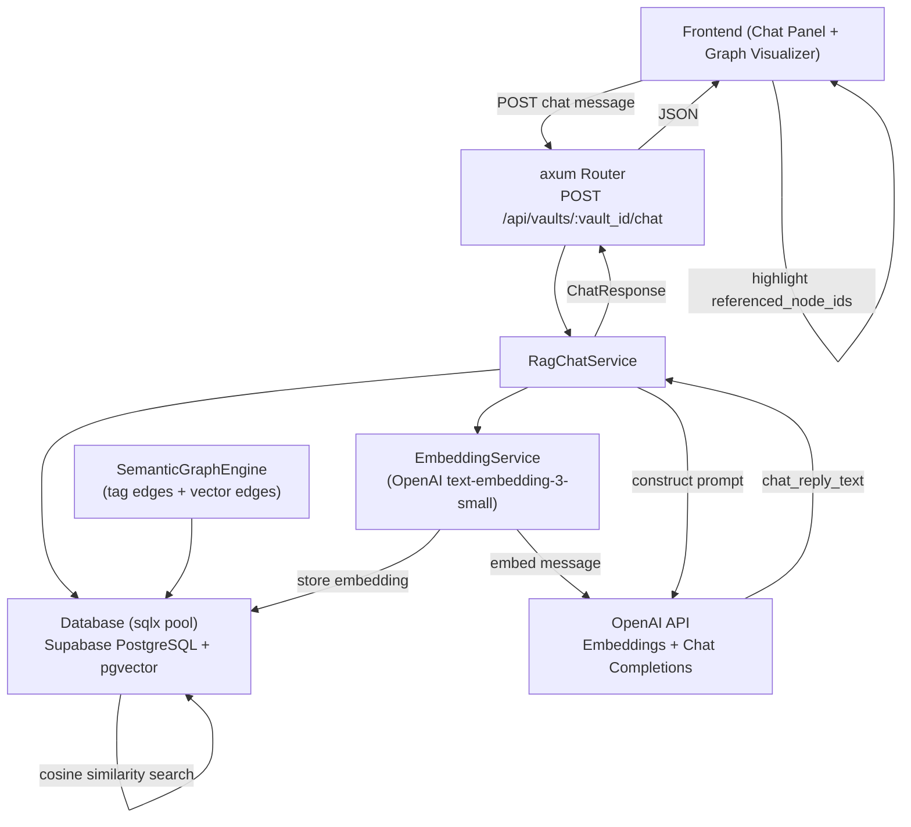

# Design Document: Vector Semantic Graph RAG Chat

## Overview

This feature improves the Cofre vault's semantic graph and RAG chat interface:

**Current State:**
- ✅ Vector embeddings are generated using Google Gemini (768-dim)
- ✅ RAG chat endpoint exists and works
- ✅ Graph visualization exists
- ❌ Graph is built from titles only (not full content)
- ❌ No visual integration between chat and graph
- ❌ UI needs modernization

**Improvements Needed:**
1. **Graph Content**: Build similarity edges from full content embeddings (transcript/scraped text), not just titles
2. **Chat Integration**: Add interactive chat panel that highlights referenced nodes in the graph
3. **UI/UX**: Modernize design with better typography, colors, spacing, and visual feedback

### Key Design Decisions

- **pgvector over a dedicated vector DB**: Supabase already runs PostgreSQL; adding pgvector avoids a new infrastructure dependency while providing HNSW indexing sufficient for vault-scale data.
- **HNSW over IVFFlat**: HNSW gives better recall at low latency without requiring a training step, which matters for small-to-medium vault sizes.
- **`text-embedding-3-small` as default**: 1536 dimensions, low cost, good quality. Configurable via `EMBEDDING_MODEL` env var.
- **Separate `EmbeddingService` and `RagChatService` structs**: Keeps embedding logic reusable (content creation, batch backfill, chat) and chat logic independently testable.
- **`GraphFilter` struct**: Encapsulates date, content-type, and user filters in one place so the graph engine signature stays stable as filters are added.

---

## Architecture



### Request Flow: Chat

1. `POST /api/vaults/:vault_id/chat` received by axum handler
2. Handler validates vault membership via `AuthService`
3. `RagChatService::process_message` called
4. `EmbeddingService::generate_embedding` converts message text → `Vec<f32>` (1536-dim)
5. `Database::find_similar_items` runs pgvector cosine similarity query, returns top-5 `ContentItem`s
6. `RagChatService` builds a system prompt with retrieved content as context
7. OpenAI Chat Completions API called → `chat_reply_text`
8. `ChatResponse { chat_reply_text, referenced_node_ids }` returned as JSON

### Request Flow: Content Creation (Embedding Side-Effect)

1. `ContentService::create_item` creates the `ContentItem` record
2. `EmbeddingService::generate_embedding` called with the item's rich text
3. `Database::upsert_embedding` stores the vector in `content_items.content_embedding`

---

## Components and Interfaces

### EmbeddingService (`src/services/embedding.rs`)

```rust
pub struct EmbeddingService {
    client: reqwest::Client,
    api_key: String,
    model: String,          // from EMBEDDING_MODEL env var, default "text-embedding-3-small"
}

impl EmbeddingService {
    pub fn from_env() -> Result<Self>;
    
    /// Generate a single embedding vector for the given text.
    pub async fn generate_embedding(&self, text: &str) -> Result<Vec<f32>>;
    
    /// Generate embeddings for multiple texts in one API call (batch endpoint).
    pub async fn generate_embeddings_batch(&self, texts: &[&str]) -> Result<Vec<Vec<f32>>>;
    
    /// Select the richest text from a ContentItem for embedding.
    pub fn extract_content_text(item: &ContentItem) -> String;
}
```

**`extract_content_text` priority order:**
1. `transcript` (Audio items)
2. Scraped text from `metadata["scraped_text"]` (Link items)
3. `title` (fallback for all types)
4. Empty string → log warning, embed empty string (pgvector allows it)

### RagChatService (`src/services/rag_chat.rs`)

```rust
pub struct RagChatService {
    embedding_service: Arc<EmbeddingService>,
    db: Arc<sqlx::PgPool>,
    llm_model: String,      // from LLM_MODEL env var, default "gpt-3.5-turbo"
    openai_api_key: String,
    client: reqwest::Client,
    top_k: usize,           // default 5
}

impl RagChatService {
    pub fn from_env(embedding_service: Arc<EmbeddingService>, db: Arc<sqlx::PgPool>) -> Result<Self>;
    
    /// Main entry point: embed message → similarity search → LLM → ChatResponse.
    pub async fn process_message(
        &self,
        vault_id: Uuid,
        user_id: Uuid,
        message: &str,
    ) -> Result<ChatResponse>;
}
```

### Updated SemanticGraphEngine (`src/services/graph.rs`)

```rust
pub struct GraphFilter {
    pub start_date: Option<DateTime<Utc>>,
    pub end_date: Option<DateTime<Utc>>,
    pub content_types: Vec<ContentType>,  // empty = all types
    pub user_id: Option<Uuid>,
    pub similarity_threshold: f32,        // default 0.8
}

impl Default for GraphFilter { ... }

impl SemanticGraphEngine {
    // Existing method preserved:
    pub fn build_graph(items, tags, item_tags) -> Graph;

    // New method: builds graph with vector similarity edges merged in
    pub fn build_graph_with_similarity(
        items: Vec<ContentItem>,
        tags: Vec<Tag>,
        item_tags: Vec<ItemTag>,
        similarity_pairs: Vec<SimilarityPair>,  // pre-fetched from DB
        filter: &GraphFilter,
    ) -> Graph;

    // Existing methods preserved:
    pub fn get_neighbors(graph: &Graph, item_id: Uuid) -> Vec<ContentItem>;
    pub fn get_items_by_special_tag(graph: &Graph, tag_id: Uuid) -> Vec<ContentItem>;
}

/// A pre-computed similarity relationship between two items
pub struct SimilarityPair {
    pub item_a: Uuid,
    pub item_b: Uuid,
    pub similarity: f32,
}
```

**Filter application in `build_graph_with_similarity`:**
1. Apply `GraphFilter` to `items` slice before building nodes
2. Build tag-based edges (existing logic)
3. Add similarity edges for pairs where both items pass the filter and `similarity >= threshold`
4. Similarity edge weight = `similarity` score (0.0–1.0)

### Database Layer (`src/db.rs` additions)

```rust
impl Database {
    /// Upsert the embedding vector for a content item.
    pub async fn upsert_embedding(
        pool: &PgPool,
        item_id: Uuid,
        embedding: &[f32],
    ) -> Result<()>;

    /// Find the top-k most similar items to a query vector within a vault.
    pub async fn find_similar_items(
        pool: &PgPool,
        vault_id: Uuid,
        query_vector: &[f32],
        limit: i64,
    ) -> Result<Vec<SimilarResult>>;

    /// Find similar items to a known item by its stored embedding.
    pub async fn find_similar_to_item(
        pool: &PgPool,
        vault_id: Uuid,
        item_id: Uuid,
        threshold: f32,
        limit: i64,
    ) -> Result<Vec<SimilarResult>>;

    /// Return all item IDs in a vault that have NULL content_embedding.
    pub async fn find_items_without_embeddings(
        pool: &PgPool,
        vault_id: Uuid,
    ) -> Result<Vec<Uuid>>;
}

pub struct SimilarResult {
    pub item: ContentItem,
    pub similarity: f32,
}
```

### axum Route Handler

```rust
// Route: POST /api/vaults/:vault_id/chat
pub async fn chat_handler(
    State(app_state): State<AppState>,
    Path(vault_id): Path<Uuid>,
    Extension(user): Extension<User>,
    Json(payload): Json<ChatRequest>,
) -> Result<Json<ChatResponse>, AppError>;

#[derive(Deserialize)]
pub struct ChatRequest {
    pub message: String,
}

#[derive(Serialize)]
pub struct ChatResponse {
    pub chat_reply_text: String,
    pub referenced_node_ids: Vec<Uuid>,  // ordered by similarity, highest first
}
```

---

## Data Models

### SQL Migration (`migrations/001_pgvector.sql`)

```sql
-- Enable pgvector extension
CREATE EXTENSION IF NOT EXISTS vector;

-- Add embedding column (nullable for backward compatibility)
ALTER TABLE content_items
    ADD COLUMN IF NOT EXISTS content_embedding vector(1536);

-- HNSW index for cosine distance (fast approximate nearest-neighbor)
CREATE INDEX IF NOT EXISTS content_items_embedding_hnsw_idx
    ON content_items
    USING hnsw (content_embedding vector_cosine_ops)
    WITH (m = 16, ef_construction = 64);
```

**Why HNSW parameters `m=16, ef_construction=64`:** These are the pgvector defaults and work well for vault-scale datasets (hundreds to low thousands of items). They can be tuned upward for larger datasets without changing application code.

### Rust Model Additions (`src/models.rs`)

```rust
/// Response from the semantic chat endpoint
#[derive(Debug, Serialize, Deserialize)]
pub struct ChatResponse {
    pub chat_reply_text: String,
    pub referenced_node_ids: Vec<Uuid>,
}

/// Request body for the semantic chat endpoint
#[derive(Debug, Deserialize)]
pub struct ChatRequest {
    pub message: String,
}

/// Configuration for the embedding and LLM services
#[derive(Debug, Clone)]
pub struct AiConfig {
    pub openai_api_key: String,
    pub embedding_model: String,   // default: "text-embedding-3-small"
    pub llm_model: String,         // default: "gpt-3.5-turbo"
    pub similarity_threshold: f32, // default: 0.8
}

impl AiConfig {
    pub fn from_env() -> Result<Self>;
}
```

### OpenAI API Payloads (internal, not exposed)

```rust
// Embedding request
#[derive(Serialize)]
struct EmbeddingRequest<'a> {
    model: &'a str,
    input: EmbeddingInput<'a>,
}

#[derive(Serialize)]
#[serde(untagged)]
enum EmbeddingInput<'a> {
    Single(&'a str),
    Batch(Vec<&'a str>),
}

// Chat completion request
#[derive(Serialize)]
struct ChatCompletionRequest<'a> {
    model: &'a str,
    messages: Vec<ChatMessage<'a>>,
    max_tokens: u32,
}

#[derive(Serialize)]
struct ChatMessage<'a> {
    role: &'a str,   // "system" | "user"
    content: &'a str,
}
```

### RAG Prompt Template

```
System: You are a helpful assistant with access to the user's vault content.
Answer the user's question using ONLY the provided context items.
Reference specific items by their ID when relevant.

Context items:
[Item ID: {uuid}]
Title: {title}
Content: {transcript_or_text}

---
[Item ID: {uuid}]
...

User: {message}
```

---

## Correctness Properties

*A property is a characteristic or behavior that should hold true across all valid executions of a system — essentially, a formal statement about what the system should do. Properties serve as the bridge between human-readable specifications and machine-verifiable correctness guarantees.*

### Property 1: Similarity search excludes the query item and respects vault isolation

*For any* vault and any content item with a stored embedding, querying similar items by that item's ID shall never include the query item itself in the results, and shall only return items belonging to the same vault.

**Validates: Requirements 6.4, 6.5**

### Property 2: Similarity results are ordered by descending similarity

*For any* query vector and any non-empty result set from `find_similar_items`, the similarity scores of consecutive results shall be non-increasing (highest similarity first).

**Validates: Requirements 6.3, 13.2**

### Property 3: Graph filter preserves only matching items and their edges

*For any* graph built with a `GraphFilter`, every node in the resulting graph shall satisfy all active filter predicates (date range, content type, user), and every edge shall connect two nodes that both appear in the filtered node set.

**Validates: Requirements 8.2, 8.3, 9.2, 9.3, 10.2, 10.3**

### Property 4: Null filter fields include all items

*For any* `GraphFilter` where `start_date`, `end_date`, `user_id` are all `None` and `content_types` is empty, the resulting graph shall contain the same nodes as an unfiltered graph.

**Validates: Requirements 8.4, 8.5, 9.4, 10.4**

### Property 5: Vector similarity edges are bidirectional

*For any* pair of items (A, B) where cosine similarity ≥ threshold, if an edge A→B exists in the graph then an edge B→A shall also exist with the same weight.

**Validates: Requirements 7.3, 7.4**

### Property 6: Tag-based edges are preserved alongside similarity edges

*For any* graph built with `build_graph_with_similarity`, every edge that would have been created by `build_graph` (tag-based) shall still be present in the result.

**Validates: Requirements 7.5, 28.1, 28.2, 28.3**

### Property 7: Chat response referenced_node_ids are a subset of vault items

*For any* chat message sent to a vault, every UUID in `referenced_node_ids` shall correspond to a `ContentItem` that belongs to that vault.

**Validates: Requirements 13.3, 15.2**

### Property 8: Items without embeddings are excluded from similarity search

*For any* vault containing items with NULL `content_embedding`, those items shall never appear in the results of `find_similar_items` or `find_similar_to_item`.

**Validates: Requirements 17.1, 17.2**

### Property 9: Embedding round-trip preserves dimensionality

*For any* non-empty text string, the embedding vector returned by `EmbeddingService::generate_embedding` shall have exactly 1536 elements (matching the `vector(1536)` column type).

**Validates: Requirements 4.5, 22.2**

### Property 10: Similarity threshold is a valid float in [0.0, 1.0]

*For any* `AiConfig` loaded from environment variables, if `SIMILARITY_THRESHOLD` is set to a value outside [0.0, 1.0], initialization shall return an error; if it is within range, the loaded value shall equal the configured value.

**Validates: Requirements 20.2, 20.4**

---

## Error Handling

### Error Variants (additions to `src/error.rs`)

```rust
pub enum Error {
    // ... existing variants ...
    EmbeddingGenerationFailed(String),  // OpenAI embedding API error
    ChatGenerationFailed(String),       // OpenAI chat completion API error
    RateLimitExceeded,                  // HTTP 429 from OpenAI
    InvalidSimilarityThreshold(f32),    // threshold outside [0.0, 1.0]
    InvalidEmbeddingModel(String),      // unrecognized model name
    InvalidLlmModel(String),            // unrecognized model name
    ItemNotFound(Uuid),                 // item_id not in vault
}
```

### Error Handling Strategy

| Scenario | Behavior |
|---|---|
| OpenAI embedding API error | Log error with item_id, return `EmbeddingGenerationFailed`. Content item is still created; embedding is NULL. |
| OpenAI chat API error | Return `ChatGenerationFailed` to client with HTTP 502. |
| HTTP 429 from OpenAI | Return `RateLimitExceeded` with HTTP 429 to client. |
| Content item has no text | Log warning, embed empty string (pgvector stores it; it will have low similarity to everything). |
| `SIMILARITY_THRESHOLD` out of range | Fail fast at startup with `InvalidSimilarityThreshold`. |
| Unknown `EMBEDDING_MODEL` | Fail fast at startup with `InvalidEmbeddingModel`. |
| User not vault member | Return HTTP 401 `Unauthorized`. |
| `referenced_node_ids` empty | Return empty array; chat reply still returned. |

### Timeout Configuration

- Embedding generation: 2-second timeout on the reqwest call (Requirement 12.3)
- Chat completion: 10-second timeout on the reqwest call (Requirement 14.5)

---

## Testing Strategy

### Unit Tests

- `EmbeddingService::extract_content_text`: test priority order (transcript > scraped_text > title > empty)
- `AiConfig::from_env`: test default values, valid overrides, invalid threshold rejection
- `SemanticGraphEngine::build_graph_with_similarity`: test filter application, similarity edge creation, tag edge preservation, bidirectionality
- `GraphFilter` default values
- RAG prompt construction: verify context items are included in the prompt string

### Property-Based Tests (proptest)

Each property above maps to one proptest. Key generators needed:

- `arb_content_item(vault_id)` — already exists in `graph.rs` tests
- `arb_embedding()` — `prop::collection::vec(any::<f32>(), 1536)`
- `arb_graph_filter()` — arbitrary combinations of optional date, content type list, optional user_id
- `arb_similarity_pairs(items)` — random pairs from the item set with random similarity scores

**Property test configuration:** minimum 100 iterations per test (proptest default is 256).

**Tag format for each test:**
```
// Feature: vector-semantic-graph-rag-chat, Property N: <property_text>
```

### Integration Tests

- `POST /api/vaults/:vault_id/chat` with a real (or mocked) OpenAI response: verify response shape, vault membership enforcement
- `Database::find_similar_items`: verify ordering and vault isolation against a test Supabase instance
- SQL migration idempotency: run migration twice, assert no error

### Frontend Pseudo-Code (Requirement 26 documentation)

```typescript
// After receiving a ChatResponse:
async function sendChatMessage(vaultId: string, message: string) {
  const response = await fetch(`/api/vaults/${vaultId}/chat`, {
    method: 'POST',
    headers: { 'Content-Type': 'application/json' },
    body: JSON.stringify({ message }),
  });
  const data: ChatResponse = await response.json();

  // Clear previous highlights
  graphVisualizer.clearHighlights();

  // Highlight referenced nodes
  for (const nodeId of data.referenced_node_ids) {
    graphVisualizer.highlightNode(nodeId, {
      effect: 'glow',
      color: '#FFD700',
    });
  }

  // Display chat reply
  chatPanel.appendMessage('assistant', data.chat_reply_text);
}

// Highlights persist until next message is sent (cleared at top of sendChatMessage)
```

**API contract:**

```
POST /api/vaults/{vault_id}/chat
Authorization: Bearer <token>
Content-Type: application/json

{ "message": "What audio recordings mention machine learning?" }

200 OK
{
  "chat_reply_text": "Based on your vault, item abc123 (Podcast on ML) ...",
  "referenced_node_ids": ["abc123...", "def456..."]
}
```
